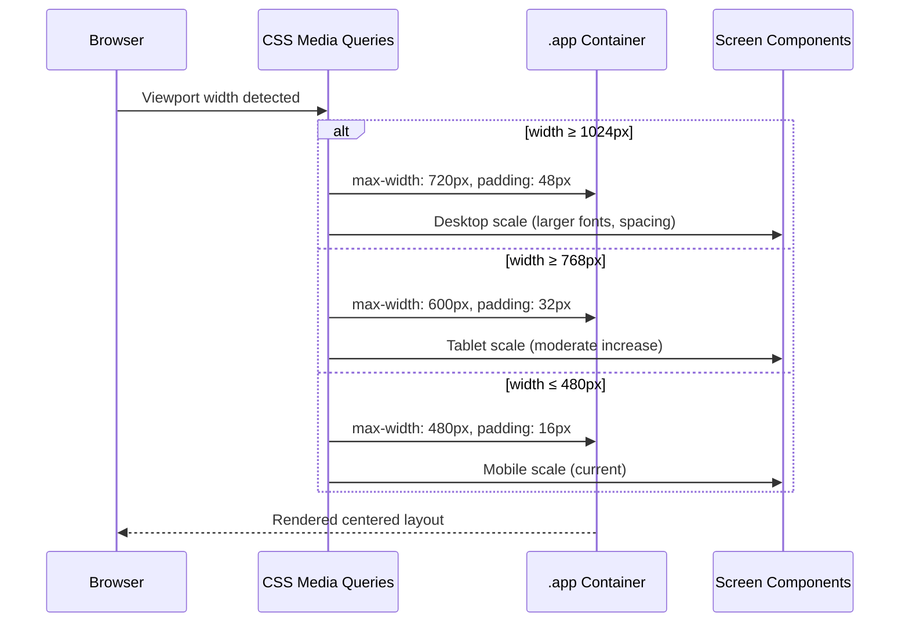

# Design Document: Desktop Responsive Layout

## Overview

The GeoWars game is currently designed as a mobile-first experience constrained to a 480px column with no desktop adaptations. On desktop monitors (≥768px), the UI appears as a tiny strip pinned to the top-left corner, wasting the majority of the viewport.

This design introduces responsive breakpoints at 768px (tablet) and 1024px (desktop) to center the application, scale key elements proportionally, and make intentional use of horizontal space. The approach preserves the existing mobile layout as the base, adds progressive enhancements via CSS media queries, and requires minimal HTML structural changes (one optional wrapper div). No JavaScript changes are needed.

The philosophy is "comfortable containment"—the game stays focused in a centered column (not stretched edge-to-edge) but expands to a comfortable reading/playing width with proportionally larger typography, silhouettes, and interaction targets.

## Architecture

```mermaid
graph TD
    subgraph Viewport["Browser Viewport"]
        subgraph AppShell["Centered App Shell (max-width varies by breakpoint)"]
            Landing["Landing Screen"]
            Game["Game Screen"]
            Results["Results Screen"]
        end
    end

    style Viewport fill:#0a0a0f,stroke:#2a2a3a
    style AppShell fill:#141420,stroke:#2a2a3a
    style Landing fill:#1a1a2e,stroke:#2a2a3a
    style Game fill:#1a1a2e,stroke:#2a2a3a
    style Results fill:#1a1a2e,stroke:#2a2a3a
```



### Layout Strategy by Breakpoint

```mermaid
graph LR
    A["≤480px<br/>Mobile (current)"] -->|"480–767px"| B["Small Tablet<br/>No change needed"]
    B -->|"768px+"| C["Tablet<br/>Centered, wider"]
    C -->|"1024px+"| D["Desktop<br/>Max comfort width"]

    style A fill:#1a1a2e,stroke:#ff3d5a
    style B fill:#1a1a2e,stroke:#ffd93d
    style C fill:#1a1a2e,stroke:#a855f7
    style D fill:#1a1a2e,stroke:#00d68f
```



| Breakpoint | `.app` max-width | Padding | Key Behavior |
|-----------|-----------------|---------|--------------|
| ≤480px | 480px | 16px sides | Current mobile layout (no change) |
| ≥768px | 600px | 32px sides | Centered via auto margins, larger text/silhouette |
| ≥1024px | 720px | 48px sides | Full desktop comfort, enhanced spacing, larger targets |

## Sequence Diagram: Responsive Adaptation



## Components and Interfaces

### Component 1: App Shell (`.app`)

**Purpose**: Root container that centers the game and constrains width based on viewport.

**Current state**: `max-width: 480px; margin: 0 auto;` — the `margin: 0 auto` already centers horizontally, but the narrow width makes it feel lost on desktop.

**Desktop adaptation**:
- Widen `max-width` progressively
- Add vertical centering for short-content screens (landing, results) using `min-height: 100vh` with flexbox
- Increase horizontal padding for breathing room

**Responsibilities**:
- Horizontal centering at all viewports
- Constraining content to a comfortable reading width
- Providing progressive padding

### Component 2: Landing Screen

**Purpose**: Brand display, mode selection, stats.

**Desktop adaptation**:
- Larger hero silhouette (200px → 240px at desktop)
- Larger tagline font size
- Mode cards get more padding and slightly larger text
- Stats bar gains breathing room
- Vertical centering in viewport via flexbox on `.app`

### Component 3: Game Screen

**Purpose**: Core gameplay — silhouette display, answer input, choices, HUD.

**Desktop adaptation**:
- Silhouette box grows taller (min-height 320px → 380px)
- Choice buttons in a 3×2 grid remain, but get larger tap targets
- Answer input and buttons scale up
- HUD elements (score, timer) gain size for visibility at arm's length

### Component 4: Results Screen

**Purpose**: End-of-game summary with score, streak, play-again actions.

**Desktop adaptation**:
- Results card gets more padding, larger font sizes
- Stat numbers scale up
- CTA button constrained to a comfortable width (not full 720px)

## Data Models

No data model changes required. This feature is purely presentational (CSS).

## Algorithmic Pseudocode

### Main Processing: CSS Cascade Resolution

```pascal
ALGORITHM applyResponsiveStyles(viewportWidth)
INPUT: viewportWidth in pixels
OUTPUT: applied CSS property values

BEGIN
  // Base mobile styles always apply (mobile-first)
  applyBaseStyles()

  // Small phone override (existing)
  IF viewportWidth <= 400 THEN
    applySmallPhoneOverrides()
  END IF

  // Tablet breakpoint
  IF viewportWidth >= 768 THEN
    set .app max-width to 600px
    set .app padding to 24px 32px 48px
    scale typography by 1.1x
    scale silhouette-box min-height to 320px
    scale hero-silhouette to 200px
    increase button padding by 4px
    increase gap values by 4px
  END IF

  // Desktop breakpoint
  IF viewportWidth >= 1024 THEN
    set .app max-width to 720px
    set .app padding to 32px 48px 56px
    scale typography by 1.2x relative to base
    scale silhouette-box min-height to 380px
    scale hero-silhouette to 240px
    increase button padding by 8px relative to base
    add subtle box-shadow to .app for depth
    constrain .cta max-width to 400px with auto margins
  END IF
END
```

**Preconditions:**
- Base mobile CSS is loaded and applied
- Viewport meta tag is present (`width=device-width, initial-scale=1.0`)

**Postconditions:**
- Layout is horizontally centered at all widths
- No horizontal scrolling occurs
- All interactive elements remain accessible (minimum 44px touch targets)
- Dark mode variables continue to cascade correctly

**Loop Invariants:** N/A (CSS cascade, not iterative)

## Key Functions with Formal Specifications

### Function 1: Tablet Media Query (≥768px)

```css
@media (min-width: 768px) {
  .app {
    max-width: 600px;
    padding: 24px 32px 48px;
  }

  .landing-tagline {
    font-size: 34px;
  }

  .hero-silhouette {
    width: 200px;
    height: 200px;
  }

  .silhouette-box {
    min-height: 320px;
    padding: 40px;
  }

  .mode-card {
    padding: 22px 20px;
  }

  .mode-title {
    font-size: 18px;
  }

  .choice-btn {
    padding: 18px 14px;
    font-size: 16px;
  }

  .score-pill {
    font-size: 20px;
  }

  .results-card {
    padding: 56px 32px;
  }

  .results-card h2 {
    font-size: 36px;
  }

  .result-stat strong {
    font-size: 32px;
  }
}
```

**Preconditions:**
- Viewport width is at least 768px
- Base styles are already applied

**Postconditions:**
- `.app` container is 600px max, centered via existing `margin: 0 auto`
- All text and interactive elements are proportionally larger
- Layout remains single-column (no multi-column rearrangement)

### Function 2: Desktop Media Query (≥1024px)

```css
@media (min-width: 1024px) {
  .app {
    max-width: 720px;
    padding: 32px 48px 56px;
  }

  .landing-tagline {
    font-size: 38px;
  }

  .hero-silhouette {
    width: 240px;
    height: 240px;
  }

  .silhouette-box {
    min-height: 380px;
    padding: 48px;
    border-radius: 24px;
  }

  .silhouette-box > img {
    max-height: 280px;
  }

  .mode-card {
    padding: 24px;
  }

  .mode-title {
    font-size: 20px;
  }

  .mode-desc {
    font-size: 14px;
  }

  .choice-btn {
    padding: 20px 16px;
    font-size: 17px;
    border-radius: 16px;
  }

  .know-btn, .options-btn {
    padding: 24px 20px;
    font-size: 18px;
    border-radius: 16px;
  }

  .score-pill {
    font-size: 22px;
    padding: 8px 18px;
  }

  .timer-container {
    width: 72px;
    height: 72px;
  }

  .timer-text {
    font-size: 20px;
  }

  .stats-bar {
    border-radius: 16px;
    margin-top: 28px;
  }

  .stat strong {
    font-size: 26px;
  }

  .stat span {
    font-size: 11px;
  }

  .results-card {
    padding: 64px 40px;
  }

  .results-card h2 {
    font-size: 40px;
  }

  .result-stat strong {
    font-size: 36px;
  }

  .result-stat {
    padding: 24px 16px;
  }

  .cta {
    max-width: 400px;
    margin-left: auto;
    margin-right: auto;
  }

  .diff-btn {
    padding: 12px 0;
    font-size: 14px;
  }

  .hint-btn {
    padding: 12px 20px;
    font-size: 14px;
  }

  .type-answer input {
    padding: 18px;
    font-size: 17px;
  }

  .feedback {
    border-radius: 24px;
  }

  .reveal-name {
    font-size: 32px;
  }
}
```

**Preconditions:**
- Viewport width is at least 1024px
- Tablet (768px) styles cascade first, then desktop overrides

**Postconditions:**
- `.app` at 720px max provides comfortable reading width without feeling stretched
- Silhouette box is prominently sized for easy identification at arm's length
- CTA buttons don't stretch to full container width (capped at 400px)
- Timer ring scales proportionally
- All font sizes enhanced for desktop viewing distance

### Function 3: Vertical Centering for Short Screens

```css
@media (min-width: 768px) {
  .app {
    display: flex;
    flex-direction: column;
    justify-content: center;
  }

  .screen {
    flex-shrink: 0;
  }
}
```

**Preconditions:**
- Only one `.screen` is visible at a time (others have `.hidden`)
- `.app` has `min-height: 100vh`

**Postconditions:**
- Active screen is vertically centered when its content is shorter than the viewport
- Game screen (which can be tall) scrolls naturally without forced centering artifacts

### Function 4: Optional Depth/Polish for Desktop

```css
@media (min-width: 1024px) {
  .app {
    background: var(--surface);
    border-radius: 24px;
    box-shadow: 0 0 80px rgba(0, 0, 0, 0.4);
    margin-top: 24px;
    margin-bottom: 24px;
    min-height: calc(100vh - 48px);
  }

  body {
    display: flex;
    align-items: flex-start;
    justify-content: center;
    padding: 0;
  }
}
```

**Preconditions:**
- Desktop viewport with sufficient height
- body has `min-height: 100vh`

**Postconditions:**
- App appears as a floating "card" on the dark background
- Subtle shadow provides depth separation
- Maintains centering horizontally
- `min-height: calc(100vh - 48px)` ensures card fills most of the viewport without touching edges

## Example Usage

```css
/* Complete addition to styles.css — append after existing @media (max-width: 400px) block */

/* ============================================================
   TABLET (≥768px)
   ============================================================ */
@media (min-width: 768px) {
  .app {
    max-width: 600px;
    padding: 24px 32px 48px;
    display: flex;
    flex-direction: column;
    justify-content: center;
  }

  .landing-tagline { font-size: 34px; }
  .hero-silhouette { width: 200px; height: 200px; }
  .silhouette-box { min-height: 320px; padding: 40px; }
  .mode-card { padding: 22px 20px; }
  .mode-title { font-size: 18px; }
  .choice-btn { padding: 18px 14px; font-size: 16px; }
  .score-pill { font-size: 20px; }
  .results-card { padding: 56px 32px; }
  .results-card h2 { font-size: 36px; }
  .result-stat strong { font-size: 32px; }
}

/* ============================================================
   DESKTOP (≥1024px)
   ============================================================ */
@media (min-width: 1024px) {
  body {
    display: flex;
    align-items: flex-start;
    justify-content: center;
  }

  .app {
    max-width: 720px;
    padding: 32px 48px 56px;
    background: var(--surface);
    border-radius: 24px;
    box-shadow: 0 0 80px rgba(0, 0, 0, 0.4);
    margin-top: 24px;
    margin-bottom: 24px;
    min-height: calc(100vh - 48px);
  }

  .landing-tagline { font-size: 38px; }
  .hero-silhouette { width: 240px; height: 240px; }
  .silhouette-box { min-height: 380px; padding: 48px; border-radius: 24px; }
  .silhouette-box > img { max-height: 280px; }
  .mode-card { padding: 24px; }
  .mode-title { font-size: 20px; }
  .mode-desc { font-size: 14px; }
  .choice-btn { padding: 20px 16px; font-size: 17px; border-radius: 16px; }
  .know-btn, .options-btn { padding: 24px 20px; font-size: 18px; border-radius: 16px; }
  .score-pill { font-size: 22px; padding: 8px 18px; }
  .timer-container { width: 72px; height: 72px; }
  .timer-text { font-size: 20px; }
  .stats-bar { border-radius: 16px; margin-top: 28px; }
  .stat strong { font-size: 26px; }
  .stat span { font-size: 11px; }
  .results-card { padding: 64px 40px; }
  .results-card h2 { font-size: 40px; }
  .result-stat strong { font-size: 36px; }
  .result-stat { padding: 24px 16px; }
  .cta { max-width: 400px; margin-left: auto; margin-right: auto; }
  .diff-btn { padding: 12px 0; font-size: 14px; }
  .hint-btn { padding: 12px 20px; font-size: 14px; }
  .type-answer input { padding: 18px; font-size: 17px; }
  .feedback { border-radius: 24px; }
  .reveal-name { font-size: 32px; }
}
```

## Correctness Properties

1. **∀ viewport width w: `.app` is horizontally centered** — `margin: 0 auto` (existing) combined with bounded `max-width` guarantees this at all breakpoints.

2. **∀ viewport width w ≥ 768px: no horizontal scrollbar appears** — max-width is always less than viewport width, padding is included via `box-sizing: border-box`.

3. **∀ interactive elements e on desktop: touch target ≥ 44px** — all buttons have padding ≥ 20px with font-size ≥ 16px, ensuring minimum 44px rendered height.

4. **∀ breakpoints b: dark mode variables cascade correctly** — no media query overrides CSS custom properties; they continue to use `var(--bg)`, `var(--surface)`, etc.

5. **∀ screens s: only one is visible at a time** — `.hidden` class uses `display: none !important`, unaffected by flexbox changes on `.app`.

6. **∀ viewport width w < 768px: zero visual changes from current behavior** — all new rules are inside `min-width: 768px` and `min-width: 1024px` queries.

## Error Handling

### Scenario 1: Content Overflow on Tablet

**Condition**: Game screen content (choices + hints + input) exceeds viewport height at 768px.
**Response**: `.app` uses `justify-content: center` with `flex-shrink: 0` on `.screen`, allowing natural overflow scroll.
**Recovery**: `overflow-y: auto` on body (browser default) handles scrolling.

### Scenario 2: Timer Ring SVG Scaling

**Condition**: Timer ring SVG has hardcoded `width="64" height="64"` in HTML attributes.
**Response**: CSS `.timer-container` override with `width: 72px; height: 72px` at desktop; SVG with `viewBox` scales correctly regardless of container size.
**Recovery**: SVG `viewBox="0 0 64 64"` ensures proportional scaling at any container size.

### Scenario 3: Very Wide Monitors (≥2560px)

**Condition**: On ultra-wide displays, the centered 720px column may feel small.
**Response**: The max-width is intentionally capped at 720px to maintain readability and focus. The surrounding dark background provides visual grounding.
**Recovery**: No action needed — games benefit from focused attention, not sprawling layouts.

## Testing Strategy

### Visual Testing Approach

- Test at exact breakpoints: 767px, 768px, 1023px, 1024px
- Test at common desktop widths: 1280px, 1440px, 1920px
- Verify centering at each width
- Confirm no horizontal overflow/scrollbar
- Verify dark-mode toggle still works at all breakpoints

### Property-Based Testing Approach

**Property Test Library**: Browser DevTools responsive mode (manual) + CSS containment assertions

Key properties to verify:
- App container width never exceeds viewport width
- All buttons maintain minimum 44px rendered height
- No style leakage between breakpoints (disabling 1024px query should fall back cleanly to 768px rules)

### Cross-Browser Testing

- Chrome, Firefox, Safari (desktop)
- Verify `flex` centering works in all (widely supported)
- Verify `box-shadow` and `border-radius` render correctly
- Verify `min-height: calc(100vh - 48px)` works (widely supported)

## Performance Considerations

- **Zero JS overhead**: All changes are CSS-only, handled by browser layout engine
- **No additional DOM elements required**: The existing `.app` wrapper is sufficient
- **No additional network requests**: No new assets needed
- **Paint performance**: `box-shadow` on `.app` at desktop is a single element, negligible cost
- **Reflow**: Media query transitions only happen on viewport resize (rare during gameplay)

## Security Considerations

No security implications. This feature is purely visual CSS with no data handling, network requests, or user input processing changes.

## Dependencies

- **None added** — this feature uses only standard CSS media queries
- **Existing dependencies unchanged**: vanilla HTML, CSS, JS stack
- **Browser support**: `min-width` media queries, flexbox, `calc()`, CSS custom properties — all supported in browsers shipping since 2018+
