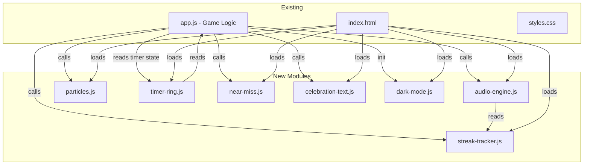

# Design Document: Game Polish 10x

## Overview

This design covers a game-feel overhaul for the Geo Game Table — layering rich synthesized audio, visual celebrations, streak mechanics, timer visualization, near-miss detection, celebration text, and dark mode onto the existing single-page application. All enhancements are additive modules that hook into the existing `app.js` event flow without structural refactoring. Zero external dependencies; all audio uses the Web Audio API and all visuals use CSS keyframes/transitions.

### Design Goals

- Make every correct guess feel **triumphant** via stacked audio + particles + celebration text
- Build **momentum** through streak tracking that escalates audio complexity and visual intensity
- Provide **urgency** cues via a timer ring and warning sounds
- Keep the codebase **accessible** (prefers-reduced-motion gating, oscillator caps, particle limits)
- Offer **dark mode** for night play and projector environments

### Module Map



### Integration Points with Existing app.js

| Existing Event / Hook | New Behavior Injected |
|---|---|
| `startRound()` | Card flip animation, timer ring reset, audio `round` → replaced by `audioEngine.playRoundStart(streak)` |
| `qaForm` submit (correct guess) | Particle burst, celebration text, streak increment, enhanced fanfare |
| `qaForm` submit (wrong guess) | Near-miss check, gentle descending tone, streak reset |
| `passCardBtn` click | Streak reset |
| `startTimer()` / timer interval | Timer ring update per second, warning sounds at 60s/30s/10s |
| `endGame()` | Extended celebration sequence |
| Page load | Dark mode init from localStorage / system preference |

---

## Architecture

### Layered Module Architecture

Each polish module is a standalone ES module–style IIFE (no build step required) that exposes a global object on `window`. Modules are loaded via `<script>` tags in `index.html` before `app.js`, or after the DOM is ready.

**Load order in index.html:**
```
data/countries.js
audio-engine.js
particles.js
timer-ring.js
streak-tracker.js
near-miss.js
celebration-text.js
dark-mode.js
app.js  (modified to call into new modules)
```

### Key Architectural Decisions

1. **No ES module imports** — All modules attach to `window` (e.g., `window.AudioEngine`) to avoid needing a bundler.
2. **Single AudioContext** — `audio-engine.js` creates one `AudioContext` (lazily on first user gesture), shared across all sound events.
3. **State colocation** — Streak state lives in `state.streak` inside the existing `state` object. Dark mode state lives in a `.dark` class on `<body>` and localStorage.
4. **Reduced-motion gate** — A single `const reducedMotion = window.matchMedia('(prefers-reduced-motion: reduce)').matches` check is used by particles, celebration text, and card animation modules.
5. **CSS-driven animations** — Card flip, particle motion, celebration text entrance/exit, timer ring transitions — all CSS keyframes. JS only creates/removes DOM elements and toggles classes.

---

## Components and Interfaces

### 1. Audio Engine (`audio-engine.js`)

Replaces the existing `playTone()` and `playSound()` functions with a richer synthesizer that adapts to streak level.

```js
window.AudioEngine = {
  /**
   * Initialize (call on first user gesture).
   * Creates AudioContext if not already created.
   */
  init(),

  /**
   * Play ascending chime sequence for new round start.
   * Uses 3+ oscillators with staggered timing.
   * @param {number} streak - current streak level (scales complexity)
   */
  playRoundStart(streak),

  /**
   * Play subtle click/pop for question/guess submission.
   * Duration ≤ 80ms.
   */
  playSubmitClick(),

  /**
   * Play triumphant fanfare for correct guess.
   * Pitch scales with pointsEarned. Streak adds harmonic layers.
   * @param {number} pointsEarned - 1–4 (card stars + speed bonus)
   * @param {number} streak - consecutive correct count
   */
  playCorrect(pointsEarned, streak),

  /**
   * Play gentle descending sine tone for wrong guess.
   */
  playWrong(),

  /**
   * Play near-miss "almost!" sound.
   * Distinct from wrong — conveys encouragement.
   */
  playNearMiss(),

  /**
   * Play discovery swoosh for clue/hint reveal.
   * Uses frequency sweep (low → high).
   */
  playReveal(),

  /**
   * Play speed-bonus sparkle overlay.
   * High-frequency short bursts layered on top of correct fanfare.
   */
  playSpeedBonus(),

  /**
   * Play end-game celebration (1.5–3 seconds).
   */
  playGameEnd(),

  /**
   * Play timer warning at given urgency level.
   * @param {'low'|'medium'|'high'} level
   */
  playTimerWarning(level),

  /**
   * Get current active oscillator count (for cap enforcement).
   * @returns {number}
   */
  getActiveNodeCount(),

  /**
   * Set master volume.
   * @param {number} volume - 0.0 to 1.0
   */
  setVolume(volume),

  /**
   * Enable/disable all audio output.
   * @param {boolean} enabled
   */
  setEnabled(enabled),
};
```

**Internal implementation details:**

- Master gain node connected to `audioCtx.destination`
- Active node counter — caps at 12 concurrent oscillators; excess calls are no-ops
- Each sound function creates oscillator(s) + BiquadFilter (lowpass/bandpass for warmth) + GainNode with ADSR-style envelope
- Streak scaling: at streak ≥ 2, add one extra harmonic oscillator (frequency × 2). At streak ≥ 3, raise base frequency by `20 * (streak - 2)` Hz per streak level

### 2. Particle System (`particles.js`)

```js
window.Particles = {
  /**
   * Emit a confetti burst in the game viewport.
   * Creates particle div elements with randomized CSS animations.
   * Respects prefers-reduced-motion (no-ops if reduced).
   * @param {HTMLElement} container - parent element for particles
   * @param {object} [options]
   * @param {number} [options.count=25] - number of particles (capped at 30)
   * @param {number} [options.duration=1800] - animation duration in ms
   */
  burst(container, options),
};
```

**Internal details:**

- Each particle is a `<div>` with class `particle`
- Randomized: `--x` (horizontal spread, -150px to +150px), `--y` (vertical rise, -200px to -50px), `--r` (rotation, 0–720deg), `--color` (from a palette of 6 colors), `--size` (6–12px)
- CSS animation: `particle-fly` keyframe (translate + rotate + opacity 1→0)
- `animationend` event listener removes the element from DOM
- Global counter enforces max 30 active particles — excess particles are not created

### 3. Timer Ring (`timer-ring.js`)

```js
window.TimerRing = {
  /**
   * Create the SVG ring element and insert into DOM.
   * @param {HTMLElement} container - where to insert the ring
   * @param {number} totalSeconds - total timer duration
   */
  create(container, totalSeconds),

  /**
   * Update the ring's fill percentage and color phase.
   * Called once per second from the timer interval.
   * @param {number} remainingSeconds
   */
  update(remainingSeconds),

  /**
   * Reset ring to full for a new game.
   * @param {number} totalSeconds
   */
  reset(totalSeconds),
};
```

**SVG structure:**

```html
<svg class="timer-ring" width="56" height="56" viewBox="0 0 56 56">
  <circle class="timer-ring__bg" cx="28" cy="28" r="24"
          fill="none" stroke="#e5eaf0" stroke-width="4"/>
  <circle class="timer-ring__progress" cx="28" cy="28" r="24"
          fill="none" stroke="var(--timer-color)" stroke-width="4"
          stroke-dasharray="150.796" stroke-dashoffset="0"
          stroke-linecap="round" transform="rotate(-90 28 28)"/>
</svg>
```

- Circumference = 2πr = 2 × π × 24 ≈ 150.796
- `stroke-dashoffset` = circumference × (1 - remaining/total)
- Color classes: `.timer-ring--green`, `.timer-ring--yellow`, `.timer-ring--red` — applied via JS class swap based on percentage thresholds (>50% green, 20–50% yellow, <20% red)
- CSS transition on `stroke-dashoffset` and `stroke` for smooth animation

### 4. Streak Tracker (`streak-tracker.js`)

```js
window.StreakTracker = {
  /**
   * Initialize streak UI element.
   * @param {HTMLElement} container - HUD row element
   */
  init(container),

  /**
   * Increment streak and trigger visual/audio escalation.
   * @returns {number} new streak count
   */
  increment(),

  /**
   * Reset streak to zero with de-escalation animation.
   */
  reset(),

  /**
   * Get current streak count.
   * @returns {number}
   */
  getCount(),
};
```

**State integration:**

- Adds `state.streak` to the existing state object (integer, starts at 0)
- Pill element: `<div class="pill streak-pill" id="streak-display">🔥 0</div>` — hidden when streak = 0, visible at ≥ 1
- At streak ≥ 3: adds CSS class `.streak-hot` to the game panel → warm glow via `box-shadow: 0 0 ${8 + streak * 4}px rgba(255, 160, 50, ${0.2 + streak * 0.05})`
- Fire emoji prefix at streak ≥ 3: `🔥🔥🔥 3` (one fire per streak level, capped at 5 emojis for readability)
- Scale pulse on increment: CSS animation `streak-pulse` (scale 1 → 1.2 → 1, 200ms)
- Reset transition: 500ms fade to default styling

### 5. Near Miss Detector (`near-miss.js`)

```js
window.NearMiss = {
  /**
   * Compute Levenshtein distance between two strings.
   * Case-insensitive, trimmed comparison.
   * @param {string} a
   * @param {string} b
   * @returns {number} edit distance
   */
  levenshtein(a, b),

  /**
   * Check if a guess is a near miss (distance ≤ 2).
   * @param {string} guess - player's guess
   * @param {string} answer - correct country name
   * @returns {boolean}
   */
  isNearMiss(guess, answer),
};
```

**Levenshtein algorithm (iterative, O(m×n) with single-row optimization):**

```js
function levenshtein(a, b) {
  a = a.trim().toLowerCase();
  b = b.trim().toLowerCase();
  if (a === b) return 0;
  if (!a.length) return b.length;
  if (!b.length) return a.length;

  let prev = Array.from({ length: b.length + 1 }, (_, i) => i);
  let curr = new Array(b.length + 1);

  for (let i = 1; i <= a.length; i++) {
    curr[0] = i;
    for (let j = 1; j <= b.length; j++) {
      const cost = a[i - 1] === b[j - 1] ? 0 : 1;
      curr[j] = Math.min(
        prev[j] + 1,       // deletion
        curr[j - 1] + 1,   // insertion
        prev[j - 1] + cost  // substitution
      );
    }
    [prev, curr] = [curr, prev];
  }
  return prev[b.length];
}
```

### 6. Celebration Text (`celebration-text.js`)

```js
window.CelebrationText = {
  /**
   * Show a random celebration phrase with animation.
   * Respects prefers-reduced-motion (shows static text briefly if reduced).
   * Won't repeat the same phrase consecutively.
   * @param {HTMLElement} container - positioned parent
   */
  show(container),
};
```

**Internal details:**

- Phrase pool (≥ 8): `["Nice!", "Crushed it!", "Legendary!", "On fire!", "Boom!", "Nailed it!", "Genius move!", "Unstoppable!", "Big brain!", "Chef's kiss!"]`
- Anti-repeat: stores last used index, re-rolls if same
- Creates an absolutely-positioned `<div class="celebration-text">` inside container
- CSS animation: `celebrate-in` (scale 0.5 → 1, opacity 0 → 1 over 200ms), then `celebrate-out` (opacity 1 → 0 over 300ms) after 1s delay
- Element self-removes after animation completes (~1.5s total)

### 7. Dark Mode (`dark-mode.js`)

```js
window.DarkMode = {
  /**
   * Initialize dark mode from localStorage or system preference.
   * Inserts toggle button into header.
   */
  init(),

  /**
   * Toggle dark mode on/off.
   * Updates body class, localStorage, and button label.
   */
  toggle(),

  /**
   * Check current dark mode state.
   * @returns {boolean}
   */
  isActive(),
};
```

**CSS custom property overrides (added to styles.css):**

```css
body.dark {
  --bg: #0f1623;
  --panel: #1a2236;
  --ink: #e8ecf5;
  --accent: #ff7a95;
  --accent-2: #7b83ff;
  --muted: #8fa3b8;
  --border: #2d3a50;
  --green: #4cd68a;
  --yellow: #ffd666;
  --purple: #b888ff;
}
```

- Toggle button: moon/sun emoji in the hero header
- localStorage key: `geo-game-dark-mode` → `"true"` or `"false"`
- Initial state: check `localStorage` first, fall back to `prefers-color-scheme: dark` media query

---

## Data Models

### State Extensions

The existing `state` object in `app.js` gains these properties:

```js
// Added to state object
state.streak = 0;              // consecutive correct guesses (resets on wrong/pass)
state.timerWarnings = {        // tracks which warning thresholds have fired
  60: false,
  30: false,
  10: false,
};
state.totalTimerSeconds = 0;   // total seconds for the current game (for ring %)
```

### Particle Element Model

```js
// Runtime particle element (created by particles.js, not persisted)
{
  element: HTMLDivElement,
  createdAt: number,  // Date.now() for cleanup tracking
}
```

### Celebration Phrase State

```js
// Internal to celebration-text.js
{
  lastIndex: number | null,  // index of last displayed phrase
  phrases: string[],         // pool of ≥ 8 phrases
}
```

### Dark Mode Persistence

```
localStorage key: "geo-game-dark-mode"
value: "true" | "false" | absent (use system preference)
```

### Timer Ring State

```js
// Internal to timer-ring.js
{
  totalSeconds: number,
  svgCircle: SVGCircleElement,  // reference to progress circle
  circumference: number,        // 2 * PI * radius
}
```

---


## Correctness Properties

*A property is a characteristic or behavior that should hold true across all valid executions of a system — essentially, a formal statement about what the system should do. Properties serve as the bridge between human-readable specifications and machine-verifiable correctness guarantees.*

### Property 1: Fanfare pitch scales with points earned

*For any* valid points-earned value (1 through 4), the base frequency of the correct-guess fanfare SHALL be strictly greater for a higher points value than for a lower one.

**Validates: Requirements 1.3**

### Property 2: Streak escalation monotonically increases audio complexity

*For any* streak level N ≥ 2, the number of oscillators used in the fanfare SHALL be greater than at streak 0–1, AND for any streak level N ≥ 3, the base frequency SHALL be at least 20 × (N − 2) Hz above the streak-2 baseline.

**Validates: Requirements 2.1, 2.2**

### Property 3: Streak reset returns audio parameters to base level

*For any* streak value N > 0, after a reset event the fanfare parameters (oscillator count, base frequency offset) SHALL equal the parameters produced at streak 0.

**Validates: Requirements 2.3**

### Property 4: Timer warning fires exactly once per threshold

*For any* monotonically decreasing sequence of remaining-seconds values that crosses a warning threshold (60, 30, or 10), the corresponding warning tone SHALL be triggered exactly once regardless of how many update ticks occur at or below that threshold.

**Validates: Requirements 3.4**

### Property 5: Timer ring depletion formula

*For any* total duration T > 0 and remaining seconds R where 0 ≤ R ≤ T, the SVG stroke-dashoffset SHALL equal circumference × (1 − R/T), where circumference = 2πr.

**Validates: Requirements 6.1**

### Property 6: Timer ring color matches percentage bracket

*For any* remaining percentage P (0–100%), the timer ring color class SHALL be: green if P > 50, yellow if 20 ≤ P ≤ 50, red if P < 20.

**Validates: Requirements 6.2, 6.3, 6.4**

### Property 7: Streak visual escalation activates at threshold

*For any* streak value N, the warm glow effect and fire emoji prefix SHALL be active if and only if N ≥ 3, and the glow intensity SHALL increase monotonically for each N above 3.

**Validates: Requirements 7.3, 7.4**

### Property 8: Streak reset produces zero

*For any* non-zero streak value, calling reset SHALL set the displayed counter to 0 and remove all escalation styling.

**Validates: Requirements 7.5**

### Property 9: Levenshtein near-miss detection correctness

*For any* pair of strings (guess, answer), `isNearMiss(guess, answer)` SHALL return true if and only if the Levenshtein distance between the trimmed, lowercased strings is ≤ 2.

**Validates: Requirements 8.1, 8.3**

### Property 10: Celebration phrase pool membership

*For any* invocation of the celebration text display, the selected phrase SHALL be a member of the predefined phrase pool.

**Validates: Requirements 9.1**

### Property 11: Celebration phrases never repeat consecutively

*For any* two consecutive invocations of the celebration text display, the second phrase SHALL differ from the first.

**Validates: Requirements 9.3**

### Property 12: Dark mode toggle round-trip

*For any* initial dark mode state, toggling twice SHALL restore the original state (body class and CSS variables match the pre-toggle state).

**Validates: Requirements 10.3**

### Property 13: Dark mode persists to localStorage

*For any* dark mode toggle action, the resulting state (active or inactive) SHALL be immediately reflected in `localStorage.getItem("geo-game-dark-mode")`.

**Validates: Requirements 10.4**

### Property 14: Particle count cap invariant

*For any* sequence of particle burst calls, the number of active particle elements in the DOM SHALL never exceed 30 at any point in time.

**Validates: Requirements 11.1**

### Property 15: Oscillator count cap invariant

*For any* sequence of sound trigger calls, the number of concurrent active oscillator nodes SHALL never exceed 12.

**Validates: Requirements 11.3**

---

## Error Handling

| Scenario | Handling Strategy |
|---|---|
| `AudioContext` not available (old browser / policy block) | `AudioEngine.init()` returns silently; all `play*` methods become no-ops. Game continues without sound. |
| `AudioContext` suspended (autoplay policy) | Attempt `audioCtx.resume()` on first user gesture. If still suspended, no-op gracefully. |
| Oscillator cap (12) reached | Additional `play*` calls are silently dropped until active count decreases. |
| Particle cap (30) reached | `Particles.burst()` creates only enough particles to reach 30, not the full requested count. |
| `localStorage` unavailable (private browsing) | Dark mode toggle still works in-session via body class; persistence silently fails with try/catch. |
| Timer ring container missing from DOM | `TimerRing.create()` logs a console warning and returns without creating SVG. All `update()` calls become no-ops. |
| `prefers-reduced-motion: reduce` active | Particle burst, celebration text animation, card flip animation, and streak pulse are all skipped. Static fallbacks shown where applicable (e.g., celebration text appears briefly without animation). |
| Levenshtein called with empty/null strings | Function handles gracefully — empty string distance equals the other string's length; null/undefined coerced to empty string via `.trim()`. |

---

## Testing Strategy

### Approach: Dual Testing (Unit + Property-Based)

This feature mixes pure functions (Levenshtein, color bracket mapping, depletion formula, phrase selection) with side-effectful modules (Web Audio, DOM manipulation). The testing strategy splits accordingly:

**Property-Based Tests** — for pure logic with wide input spaces:
- Levenshtein distance correctness (Property 9)
- Timer ring formula and color mapping (Properties 5, 6)
- Streak escalation monotonicity (Properties 2, 7)
- Celebration anti-repeat (Property 11)
- Cap invariants (Properties 14, 15)
- Dark mode round-trip (Property 12)

**Unit Tests (example-based)** — for specific integration behaviors:
- Audio engine creates correct oscillator types for each event
- Particle DOM cleanup after animation end
- Timer warning fires at each threshold
- Dark mode initial state from system preference
- Card flip class toggle on round start
- Near-miss triggers "SO CLOSE!" feedback text

### PBT Library

**Library:** [fast-check](https://github.com/dubzzz/fast-check) (if a test runner is added later) or a minimal inline PBT harness (~30 lines) that generates random inputs and runs N iterations.

Since the project has no build step or test runner, property tests can be implemented as a standalone `tests/properties.html` file that runs in-browser using a lightweight inline PBT loop:

```js
function forAll(gen, prop, iterations = 100) {
  for (let i = 0; i < iterations; i++) {
    const input = gen();
    const result = prop(input);
    if (!result) throw new Error(`Property failed on input: ${JSON.stringify(input)}`);
  }
}
```

### PBT Configuration

- **Minimum iterations:** 100 per property
- **Tag format:** `Feature: game-polish-10x, Property {N}: {title}`
- Each property test maps 1:1 to a correctness property above

### Key Test Files

| File | Contents |
|---|---|
| `tests/properties.html` | In-browser PBT runner for all 15 properties |
| `tests/unit-audio.html` | Unit tests for AudioEngine with mocked AudioContext |
| `tests/unit-particles.html` | Unit tests for Particle DOM creation/cleanup |
| `tests/unit-darkmode.html` | Unit tests for Dark Mode toggle + localStorage |

### What Is NOT Tested via PBT

- CSS animation visual appearance (use manual visual QA)
- Web Audio actual sound output (use integration/manual testing)
- Cross-browser rendering differences (manual QA matrix)
- Performance on low-end devices (manual testing with DevTools throttling)
