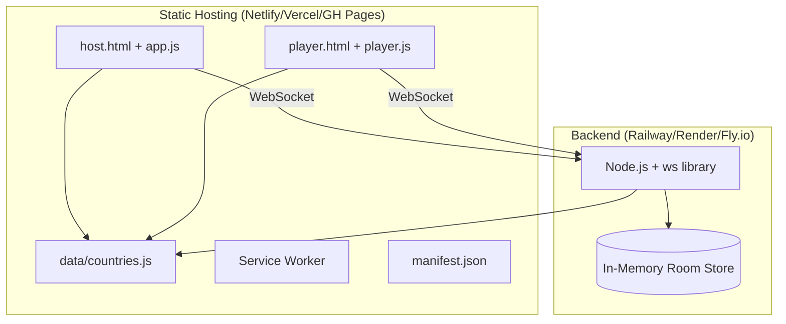
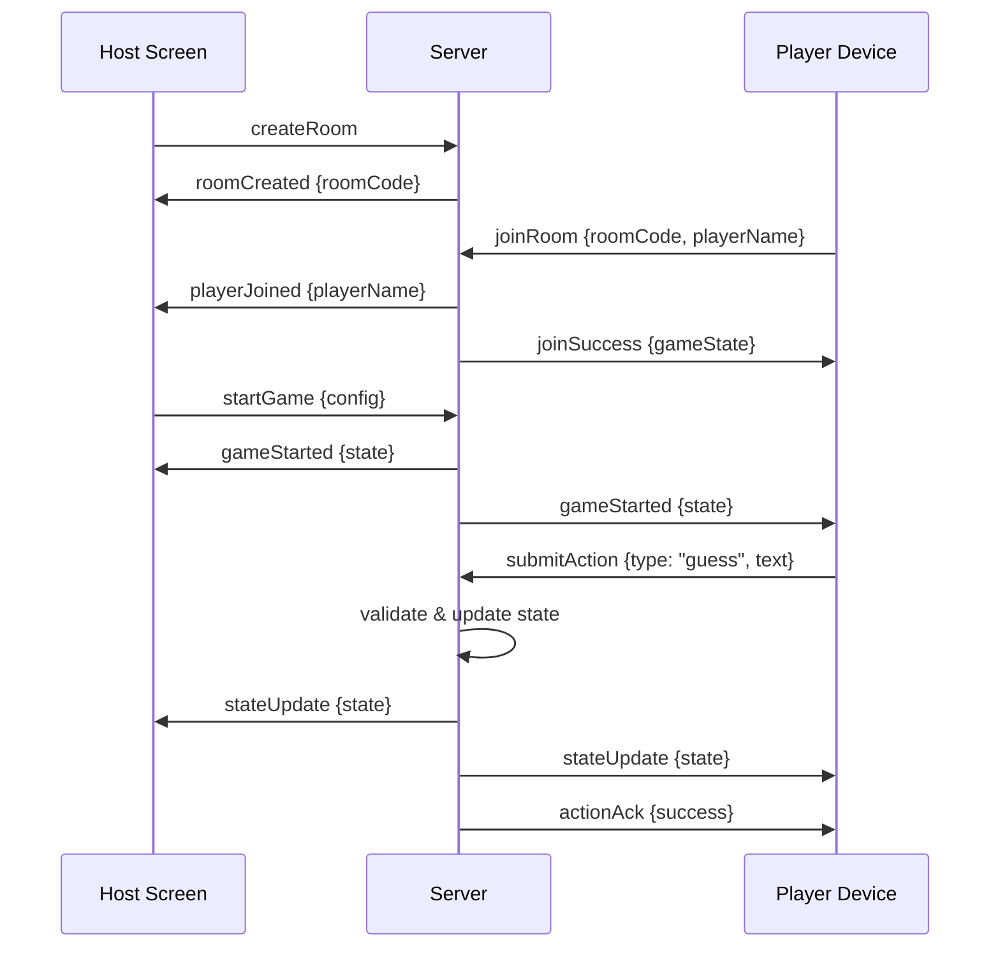
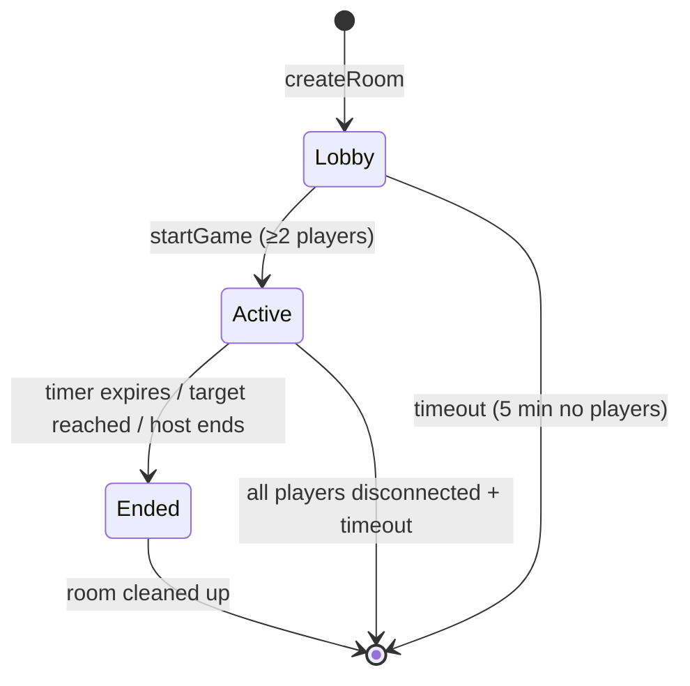
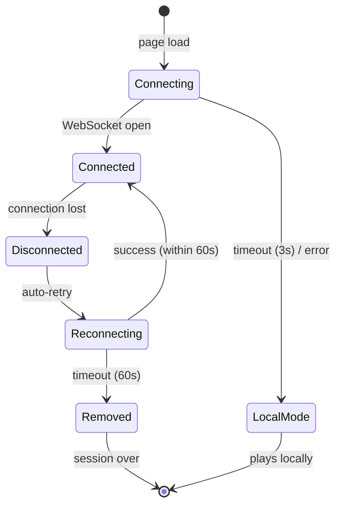

# Design Document: Multiplayer Room Code

## Overview

This design transforms the existing Geo Game Table from a single-device pass-and-play game into a Jackbox-style multiplayer party game. A host displays the game board on a shared screen (TV/projector) while players join from their personal devices using a short room code. The backend is a single Node.js WebSocket server that manages rooms, validates all game actions, and broadcasts state. The existing local game mode continues to work without any server dependency.

### Key Design Decisions

1. **Vanilla stack** — No frontend frameworks. Host and player UIs are separate HTML entry points (`host.html`, `player.html`) sharing common styles and the same `data/countries.js` module.
2. **Server-authoritative** — The server owns all game state. Clients render from server broadcasts. This prevents cheating and ensures consistency.
3. **JSON WebSocket protocol** — All messages are JSON objects with a `type` field for routing. Simple to debug and extend.
4. **In-memory state** — No database. Rooms exist only while the server process runs. This keeps deployment trivially simple.
5. **Graceful degradation** — If the server is unreachable, the host frontend falls back to the existing local pass-and-play mode seamlessly.
6. **Shared country data** — `data/countries.js` is consumed by both client (via `<script>` tag) and server (via CommonJS/ESM import) from a single source of truth.

## Architecture

### High-Level System Diagram



### Data Flow Diagram



### Room State Machine



## Components and Interfaces

### Frontend Components

#### 1. Host Screen (`host.html` + `host.js`)

**Responsibilities:**
- Display room code and QR code during lobby
- Show game board (card details for clue-giver, hidden overlay for guessers)
- Render question log, scores, timer, round info
- Fall back to local mode if server unreachable

**Key Functions:**
```typescript
// Connection management
function connectToServer(serverUrl: string): WebSocket
function handleFallbackToLocal(): void

// Lobby
function displayRoomCode(code: string): void
function renderQRCode(joinUrl: string): void
function updatePlayerList(players: PlayerInfo[]): void

// Game rendering
function renderHostCard(card: CountryCard, isRevealed: boolean): void
function appendToQuestionLog(entry: LogEntry): void
function updateScores(scores: Record<string, PlayerScore>): void
function updateTimer(remainingSeconds: number): void
function renderGameSummary(results: GameResults): void
```

#### 2. Player Screen (`player.html` + `player.js`)

**Responsibilities:**
- Join room via code entry or QR scan URL
- Display role-specific UI (clue-giver vs guesser)
- Submit questions and guesses
- Display connection status and errors

**Key Functions:**
```typescript
// Connection
function joinRoom(roomCode: string, playerName: string): void
function handleReconnect(playerId: string): void

// Guesser interface
function renderGuesserUI(state: GameState): void
function submitAction(type: "question" | "guess", text: string): void

// Clue-giver interface
function renderClueGiverUI(card: CountryCard): void
function revealClue(clueType: "builtin" | "nearby"): void
```

#### 3. Shared Modules

| Module | Purpose |
|--------|---------|
| `data/countries.js` | Country card data (shared with server) |
| `shared/protocol.js` | Message type constants and schema helpers |
| `shared/validation.js` | Room code format validation, name validation |

### Backend Components

#### 4. WebSocket Server (`server/index.js`)

**Responsibilities:**
- HTTP health check endpoint (`GET /health`)
- WebSocket upgrade handling
- Route incoming messages by `type` field
- Manage client connections and heartbeats

**Key Functions:**
```typescript
function startServer(port: number): void
function handleConnection(ws: WebSocket, request: http.IncomingMessage): void
function routeMessage(ws: WebSocket, message: ClientMessage): void
function broadcastToRoom(roomCode: string, message: ServerMessage): void
function sendToClient(ws: WebSocket, message: ServerMessage): void
```

#### 5. Room Manager (`server/roomManager.js`)

**Responsibilities:**
- Create and destroy rooms
- Generate unique room codes
- Track active rooms and enforce limits
- Handle room timeout cleanup

**Key Functions:**
```typescript
function createRoom(hostWs: WebSocket): Room
function getRoom(roomCode: string): Room | null
function deleteRoom(roomCode: string): void
function generateRoomCode(): string
function startCleanupTimers(): void
```

#### 6. Game Engine (`server/gameEngine.js`)

**Responsibilities:**
- Manage game state transitions (lobby → active → ended)
- Validate player actions against rules
- Handle scoring, role rotation, timer
- Process reconnections

**Key Functions:**
```typescript
function startGame(room: Room, config: GameConfig): GameState
function processAction(room: Room, playerId: string, action: PlayerAction): ActionResult
function advanceRound(room: Room): void
function handleDisconnect(room: Room, playerId: string): void
function handleReconnect(room: Room, playerId: string, ws: WebSocket): void
function checkGameEnd(room: Room): GameEndReason | null
```

#### 7. Timer Service (`server/timerService.js`)

**Responsibilities:**
- Per-room countdown management
- Broadcast remaining time every second
- Trigger game-end on expiry

**Key Functions:**
```typescript
function startTimer(roomCode: string, durationSeconds: number, onTick: Function, onExpire: Function): void
function stopTimer(roomCode: string): void
function getRemainingTime(roomCode: string): number
```

## Data Models

### Room State

```typescript
interface Room {
  code: string;                    // 4-char room code
  state: "lobby" | "active" | "ended";
  hostWs: WebSocket;
  players: Map<string, Player>;    // playerId → Player
  config: GameConfig;
  game: GameState | null;
  createdAt: number;
  lastActivity: number;
}

interface Player {
  id: string;                      // UUID assigned on join
  name: string;                    // Display name (1-16 chars)
  ws: WebSocket | null;            // null when disconnected
  connected: boolean;
  joinOrder: number;               // Index for rotation
  disconnectedAt: number | null;   // Timestamp for reconnection window
  ready: boolean;                  // Lobby ready state
}

interface GameConfig {
  mode: "timer" | "points";
  timerMinutes: number;            // 5-45
  targetPoints: number;            // 5-50
  difficultyPool: "all" | "easy" | "medium" | "hard" | "easy-medium" | "medium-hard";
}
```

### Game State

```typescript
interface GameState {
  roundNumber: number;
  currentCard: CountryCard;
  clueGiverPlayerId: string;
  questionCount: number;
  questionLog: LogEntry[];
  scores: Record<string, PlayerScore>;  // playerId → score
  clueRevealed: boolean;
  nearbyRevealed: boolean;
  timerRemaining: number | null;        // seconds, null for points mode
  deck: number[];                       // remaining card IDs
  usedCardIds: Set<number>;
  rotationOrder: string[];              // playerIds in join order
}

interface PlayerScore {
  points: number;
  easy: number;
  medium: number;
  hard: number;
}

interface LogEntry {
  playerId: string;
  playerName: string;
  type: "question" | "guess" | "system";
  text: string;
  result: string;
  timestamp: number;
}
```

### WebSocket Message Protocol

All messages are JSON objects with a `type` field. Messages are categorized as client-to-server (C→S) and server-to-client (S→C).

#### Client → Server Messages

```typescript
// Host messages
interface CreateRoomMessage {
  type: "createRoom";
}

interface StartGameMessage {
  type: "startGame";
  config: GameConfig;
}

interface HostPassCardMessage {
  type: "hostPassCard";
}

interface HostRevealAnswerMessage {
  type: "hostRevealAnswer";
}

interface HostEndGameMessage {
  type: "hostEndGame";
}

// Player messages
interface JoinRoomMessage {
  type: "joinRoom";
  roomCode: string;
  playerName: string;
}

interface PlayerReadyMessage {
  type: "playerReady";
}

interface SubmitActionMessage {
  type: "submitAction";
  actionType: "question" | "guess";
  text: string;
}

interface RevealClueMessage {
  type: "revealClue";
  clueType: "builtin" | "nearby";
}

// Shared
interface ReconnectMessage {
  type: "reconnect";
  roomCode: string;
  playerId: string;
}

interface PingMessage {
  type: "ping";
}
```

#### Server → Client Messages

```typescript
interface RoomCreatedMessage {
  type: "roomCreated";
  roomCode: string;
}

interface JoinSuccessMessage {
  type: "joinSuccess";
  playerId: string;
  gameState: LobbyState | GameState;
}

interface PlayerJoinedMessage {
  type: "playerJoined";
  player: { id: string; name: string; ready: boolean };
  players: PlayerInfo[];
}

interface PlayerLeftMessage {
  type: "playerLeft";
  playerId: string;
  playerName: string;
  players: PlayerInfo[];
}

interface PlayerDisconnectedMessage {
  type: "playerDisconnected";
  playerId: string;
  playerName: string;
}

interface PlayerReconnectedMessage {
  type: "playerReconnected";
  playerId: string;
  playerName: string;
}

interface GameStartedMessage {
  type: "gameStarted";
  state: GameState;
}

interface StateUpdateMessage {
  type: "stateUpdate";
  state: GameState;
}

interface TimerTickMessage {
  type: "timerTick";
  remaining: number;
}

interface RoundStartedMessage {
  type: "roundStarted";
  roundNumber: number;
  clueGiverId: string;
  clueGiverName: string;
  card: CountryCard | null;  // null for guessers, full card for clue-giver and host
  mission: string;
}

interface ActionAckMessage {
  type: "actionAck";
  success: boolean;
  error?: string;
}

interface ActionBroadcastMessage {
  type: "actionBroadcast";
  entry: LogEntry;
  questionCount: number;
  scores: Record<string, PlayerScore>;
}

interface ClueRevealedMessage {
  type: "clueRevealed";
  clueType: "builtin" | "nearby";
  text: string;
}

interface RoundEndedMessage {
  type: "roundEnded";
  reason: "correct" | "pass" | "reveal" | "clueGiverDisconnected";
  answer: string;
  scores: Record<string, PlayerScore>;
  nextClueGiverId: string;
  nextClueGiverName: string;
}

interface GameEndedMessage {
  type: "gameEnded";
  reason: "timer" | "points" | "hostEnded" | "allDisconnected";
  winner?: { id: string; name: string; points: number };
  finalScores: Record<string, PlayerScore>;
  stats: { rounds: number; correctGuesses: number; totalPoints: number };
}

interface ErrorMessage {
  type: "error";
  code: string;
  message: string;
}

interface PongMessage {
  type: "pong";
}
```

### Room Code Generation

Valid characters: `A-Z` and `2-9` (32 characters, excluding 0, 1, O, I for visual clarity).

Total possible codes: 32^4 = **1,048,576** unique codes.

```typescript
const ROOM_CODE_CHARS = "ABCDEFGHJKLMNPQRSTUVWXYZ23456789"; // 32 chars

function generateRoomCode(existingCodes: Set<string>): string {
  let code: string;
  do {
    code = "";
    for (let i = 0; i < 4; i++) {
      code += ROOM_CODE_CHARS[Math.floor(Math.random() * 32)];
    }
  } while (existingCodes.has(code));
  return code;
}
```

### Session Statistics (localStorage)

```typescript
interface SessionRecord {
  date: string;           // ISO timestamp
  mode: "timer" | "points";
  playerName: string;
  rank: number;
  points: number;
  correctGuesses: number;
  totalPlayers: number;
  totalRounds: number;
}

interface PlayerProfile {
  gamesPlayed: number;
  totalPoints: number;
  totalCorrectGuesses: number;
  personalBest: number;
  sessions: SessionRecord[];  // max 50, FIFO
}
```

## Correctness Properties

*A property is a characteristic or behavior that should hold true across all valid executions of a system — essentially, a formal statement about what the system should do. Properties serve as the bridge between human-readable specifications and machine-verifiable correctness guarantees.*

### Property 1: Room code generation produces valid, unique codes

*For any* set of existing active room codes, generating a new room code SHALL produce a 4-character string composed exclusively of characters from the set {A-Z, 2-9} (excluding 0, 1, O, I), and the generated code SHALL NOT be present in the existing active codes set.

**Validates: Requirements 1.1, 1.2**

### Property 2: Join validation enforces room state and capacity

*For any* room code submission, the server SHALL accept the join request if and only if: (a) the code matches an active room, (b) the room is in "lobby" state, and (c) the room has fewer than 8 connected players. All other combinations SHALL be rejected with an appropriate error.

**Validates: Requirements 2.1, 2.6, 2.8**

### Property 3: Player name validation accepts valid names and rejects invalid or duplicate names

*For any* string submitted as a display name, the server SHALL accept it if and only if: after trimming leading/trailing spaces, it is 1-16 characters long, consists only of letters, numbers, and spaces, and is not already in use (case-insensitive) by another player in the same room. Invalid or duplicate names SHALL be rejected.

**Validates: Requirements 2.3, 2.4**

### Property 4: Game start requires minimum player count

*For any* room in lobby state, the server SHALL transition to "active" state if and only if at least 2 players are connected. If fewer than 2 players are connected, the start request SHALL be rejected and the room SHALL remain in "lobby" state.

**Validates: Requirements 3.4, 3.5**

### Property 5: Server rejects invalid actions without state mutation

*For any* game state and any player action that violates game rules (question after cap reached, guess from clue-giver, action from non-room member, action in wrong state), processing that action SHALL leave the game state unchanged and return an error to the sender.

**Validates: Requirements 6.3, 6.4**

### Property 6: Broadcast ordering consistency

*For any* sequence of N valid events processed by the server, all connected clients in the same room SHALL receive the corresponding broadcast messages in the exact same order the events were processed.

**Validates: Requirements 6.7**

### Property 7: Clue-giver rotation follows join order

*For any* game with N connected players, the clue-giver for round R SHALL be the player at index ((R-1) mod N) in the original join-sequence order, and this rotation order SHALL remain unchanged across all rounds of the session.

**Validates: Requirements 7.2, 7.6**

### Property 8: Rotation skips disconnected players

*For any* game where the next player in rotation order is disconnected, the server SHALL skip all consecutive disconnected players and assign the clue-giver role to the next connected player in rotation order.

**Validates: Requirements 7.7, 8.7**

### Property 9: Reconnection restores full player state

*For any* player who disconnects and reconnects within the 60-second reconnection window, the server SHALL restore that player to the same room with their scores, name, join order, and role intact — the player's state after reconnection SHALL be identical to their state at the moment of disconnection.

**Validates: Requirements 8.2**

### Property 10: Game configuration validation

*For any* game configuration submitted by the host, the server SHALL accept it if and only if: mode is "timer" or "points", timer minutes is an integer in [5, 45], target points is an integer in [5, 50], and difficulty pool is one of the valid enum values. Invalid configurations SHALL be rejected.

**Validates: Requirements 9.1**

### Property 11: Scoring formula correctness

*For any* correct guess on a card with star value S (1, 2, or 3) and a current question count Q (0-10), the points awarded SHALL equal S + 1 if Q ≤ 5, or S if Q > 5.

**Validates: Requirements 9.5**

### Property 12: Question cap enforcement

*For any* round, the server SHALL accept question-type submissions while the question count is below 10, and SHALL reject any question-type submission when the count has reached 10. The question count SHALL never exceed 10.

**Validates: Requirements 9.6**

### Property 13: Guess matching uses case-insensitive exact comparison

*For any* country card with name N and any guess string G, the guess SHALL be judged correct if and only if G.toLowerCase() === N.toLowerCase(). No partial matching, fuzzy matching, or normalization beyond case folding SHALL be applied.

**Validates: Requirements 9.7**

### Property 14: Win condition triggers game end

*For any* game in race-to-points mode with target T, when a player's score reaches or exceeds T after a correct guess, the server SHALL immediately end the game and declare that player the winner.

**Validates: Requirements 9.4**

### Property 15: Session storage maintains FIFO cap

*For any* sequence of session records stored to localStorage, the stored array SHALL contain at most 50 records. When a new record is added and the array already contains 50 records, the oldest record SHALL be removed before adding the new one.

**Validates: Requirements 10.1**

### Property 16: Leaderboard ordering

*For any* set of player scores at game end, the leaderboard SHALL display players ordered from highest points to lowest points. Players with equal points may appear in any relative order.

**Validates: Requirements 10.7**

## Error Handling

### Server-Side Errors

| Error Scenario | Response | Recovery |
|---------------|----------|----------|
| Invalid message JSON | Send `error` with code `INVALID_MESSAGE` | Connection stays open, message discarded |
| Unknown message type | Send `error` with code `UNKNOWN_TYPE` | Connection stays open |
| Room not found | Send `error` with code `ROOM_NOT_FOUND` | Client shows error, prompts retry |
| Room full (8 players) | Send `error` with code `ROOM_FULL` | Client shows capacity message |
| Game already started | Send `error` with code `GAME_IN_PROGRESS` | Client shows "game in progress" message |
| Duplicate name | Send `error` with code `NAME_TAKEN` | Client prompts for new name |
| Invalid action (out of turn) | Send `error` with code `INVALID_ACTION` | Client shows error toast, state unchanged |
| Question cap reached | Send `error` with code `QUESTION_CAP` | Client disables question submit |
| All room codes exhausted | Send `error` with code `NO_CODES_AVAILABLE` | Client shows "try again later" |
| Host already has room | Send `error` with code `ALREADY_HAS_ROOM` | Client shows existing room code |

### Client-Side Errors

| Error Scenario | Behavior |
|---------------|----------|
| WebSocket connection fails | Retry 3 times with exponential backoff (1s, 2s, 4s), then fall back to local mode |
| Server unreachable on page load | After 3s timeout, show local game UI with multiplayer controls hidden |
| Message send fails | Show error toast, retain input text, allow retry |
| Reconnection window expires | Show "disconnected" message with option to rejoin as new player |
| localStorage unavailable | Continue game, skip stats persistence, show notification |
| QR code library fails to load | Show room code in large text only, hide QR container |

### Connection Lifecycle



## Testing Strategy

### Property-Based Testing

**Library:** [fast-check](https://github.com/dubzzz/fast-check) for JavaScript/TypeScript property-based testing.

**Configuration:** Each property test runs a minimum of 100 iterations with shrinking enabled.

**Tag format:** Each test is tagged with a comment: `// Feature: multiplayer-room-code, Property {N}: {title}`

Properties 1-16 from the Correctness Properties section above will each be implemented as a single property-based test targeting the pure logic functions:

| Property | Module Under Test | Generator Strategy |
|----------|------------------|-------------------|
| 1 (Room codes) | `roomManager.generateRoomCode` | Sets of 0-1000 random existing codes |
| 2 (Join validation) | `gameEngine.validateJoin` | Random room states × random codes |
| 3 (Name validation) | `gameEngine.validateName` | Random unicode strings 0-100 chars × existing name lists |
| 4 (Game start) | `gameEngine.startGame` | Rooms with 0-10 players |
| 5 (Invalid action rejection) | `gameEngine.processAction` | Random invalid actions × game states |
| 6 (Broadcast order) | `server.broadcastToRoom` | Sequences of 2-20 events |
| 7 (Rotation) | `gameEngine.getNextClueGiver` | Player counts 2-8 × round numbers 1-100 |
| 8 (Skip disconnected) | `gameEngine.getNextClueGiver` | Random disconnect patterns |
| 9 (Reconnection) | `gameEngine.handleReconnect` | Random game states × disconnect/reconnect |
| 10 (Config validation) | `gameEngine.validateConfig` | Random config objects |
| 11 (Scoring) | `gameEngine.calculateScore` | Star values 1-3 × question counts 0-10 |
| 12 (Question cap) | `gameEngine.processAction` | Rounds with 0-15 questions submitted |
| 13 (Guess matching) | `gameEngine.checkGuess` | Random strings × country names |
| 14 (Win condition) | `gameEngine.checkGameEnd` | Random score states near target |
| 15 (FIFO storage) | `sessionStorage.addSession` | Arrays of 0-100 session records |
| 16 (Leaderboard) | `results.rankPlayers` | Random score sets for 2-8 players |

### Unit Tests (Example-Based)

- Lobby UI rendering (host shows player list, config options)
- Player device role-specific UI switching
- QR code generation with correct join URL
- Local mode fallback when server unavailable
- Error display messages for each error code
- Sound effect triggers on game events
- CSV export preserves existing format

### Integration Tests

- Full WebSocket connection lifecycle (connect → join → play → disconnect → reconnect)
- Timer broadcast at 1-second intervals
- Multi-client broadcast latency (<300ms)
- Room cleanup after 5-minute inactivity timeout
- Clue-giver disconnect triggers 15-second timeout then round advance
- 50 concurrent rooms without degradation
- Service worker caching and offline mode activation

### End-to-End Tests

- Complete game flow: create room → players join → play rounds → game ends
- Reconnection mid-game preserves scores and state
- Local mode plays identically to current behavior (regression)
- PWA install prompt and offline solo practice mode

